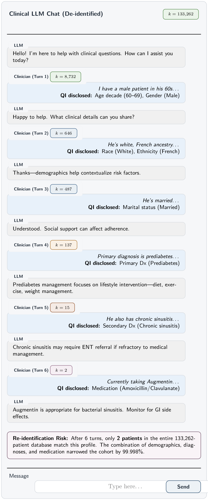
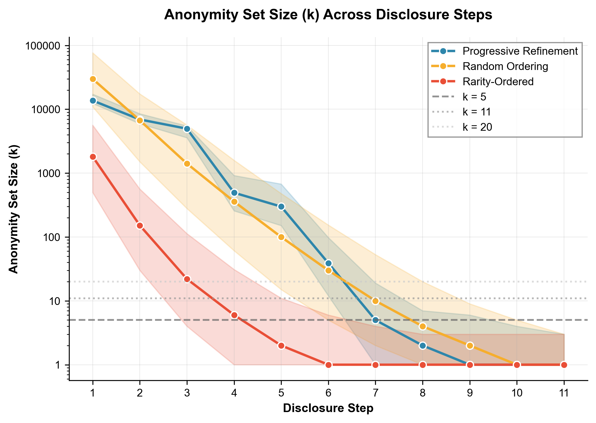

# K-Anonymity Decay in Multi-Turn Clinical LLM Conversations

[](LICENSE)
[](https://www.python.org/downloads/)

## The Problem

[HIPAA Safe Harbor](https://www.hhs.gov/hipaa/for-professionals/privacy/special-topics/de-identification/index.html) (45 CFR §164.514) permits disclosure of health information stripped of 18 direct identifiers: names, addresses, dates, phone numbers, SSNs, medical record numbers, etc. Under Safe Harbor, generalized demographics (age in decades, broad geographic regions) and clinical codes are considered *sufficiently de-identified*.

**The paradox:** A clinician using an LLM may disclose only Safe Harbor-compliant information—age decade, gender, race, diagnoses, medications—with none of the 18 prohibited identifiers. Yet across a multi-turn conversation, these *quasi-identifiers* accumulate and combine. The patient's **k-anonymity** (the number of people sharing identical attributes) collapses from thousands to single digits.

<p align="center">
  
</p>

**Individual compliance does not guarantee cumulative privacy protection.**

## What We Found

<p align="center">
  
</p>

**~80% of patients reach k < 5 within a typical clinical conversation.**

| Disclosure Model | Median Turns to k<5 | Description |
|------------------|---------------------|-------------|
| Progressive | 7 | Demographics first, then clinical details |
| Random | 8 | Unpredictable disclosure order |
| Rarity-Ordered | **4** | Rare attributes disclosed first (worst case) |

**Example:** A 60-year-old male with prediabetes starts with k = 133,262 (the full population). After 6 conversational turns disclosing age, gender, race, ethnicity, marital status, and primary condition, k collapses to just 2.

## Methods

- **Population:** 133,262 synthetic patients ([Synthea](https://synthea.mitre.org/))
- **Sample:** 5,000 patients simulated
- **Quasi-identifiers:** 23 attributes across demographics, conditions, medications, procedures, allergies
- **Thresholds:** k < 5, k < 11, k < 20 (aligned with CMS, Epic, TriNetX standards)

## Installation

**Requirements:** Python 3.9+

```bash
git clone https://github.com/JamesWeatherhead/k-anonymity-collapse.git
cd k-anonymity-collapse
pip install -r requirements.txt
```

## Data

This study uses **Synthea** synthetic EHR data (publicly available, no IRB required):

1. Download: https://synthea.mitre.org/downloads
2. Select: **SyntheticMass Data, Version 2 (May 24, 2017)**
3. Extract the `output_2` csv folder

> Walonoski J, et al. Synthea: An approach, method, and software mechanism for generating synthetic patients and the synthetic electronic health care record. *J Am Med Inform Assoc*. 2018;25(3):230-238. doi:[10.1093/jamia/ocx079](https://doi.org/10.1093/jamia/ocx079)

## Reproducing Results

```bash
# Quick test (~30 min)
python main.py --data-dir /path/to/output_2 --sample-size 1000 --n-permutations 10

# Full analysis (~5 hours)
python main.py --data-dir /path/to/output_2 --sample-size 5000 --n-permutations 30 --seed 42
```

### Outputs

```
results/
├── tables/
│   ├── table1_demographic_summary.csv
│   ├── table2_k_by_turn.csv
│   └── table3_threshold_stats.csv
├── figures/
│   ├── fig1_k_decay_curves.pdf
│   ├── fig2_turns_to_threshold.pdf
│   └── fig4_survival_curves.pdf
└── analysis_report.yaml
```

## Code Structure

```
├── main.py                  # CLI entry point
├── src/
│   ├── data_loader.py       # Synthea CSV parsing, QI extraction
│   ├── anonymity_engine.py  # k-anonymity computation
│   ├── disclosure_models.py # Progressive, random, rarity-ordered models
│   ├── simulation_runner.py # Simulation orchestration
│   └── visualization.py     # Publication figures
└── tests/                   # pytest suite
```

## Tests

```bash
pytest tests/ -v
```

## Citation

```bibtex
@unpublished{weatherhead2025kanonymity,
  title={K-Anonymity Decay in Multi-Turn Clinical LLM Conversations},
  author={Weatherhead, James},
  note={Under review at Frontiers in Digital Health},
  year={2025}
}
```

## License

MIT License - see [LICENSE](LICENSE)

## Contact

**James Weatherhead**
MD-PhD Student, Experimental Pathology
University of Texas Medical Branch
jacweath@utmb.edu
