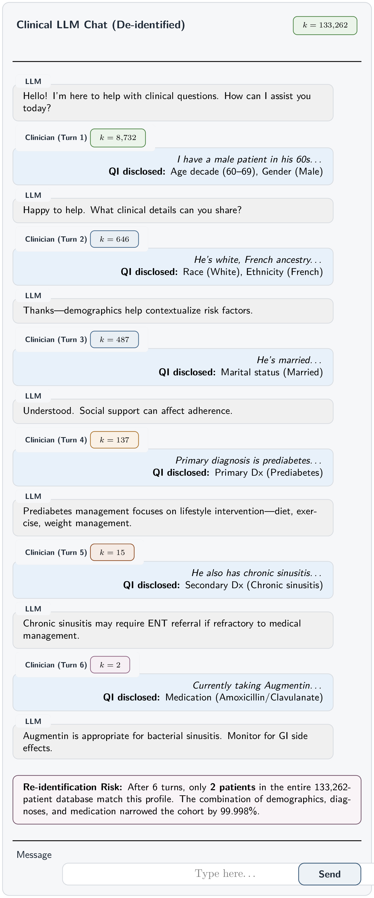
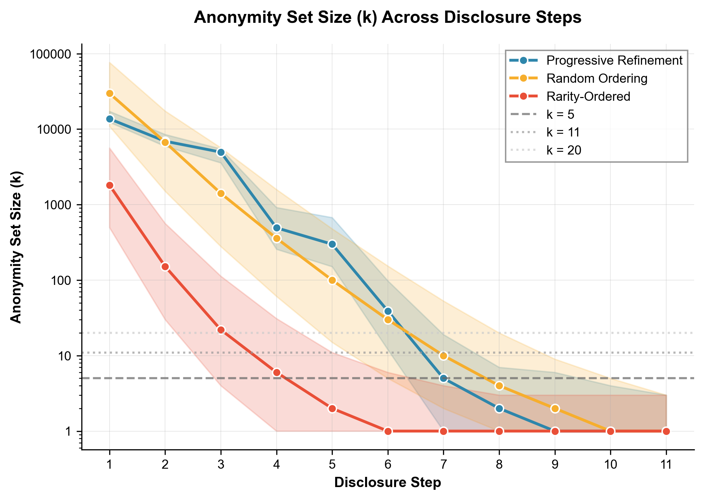

# K-Anonymity Decay in Multi-Turn Clinical LLM Conversations

[](LICENSE)
[](https://doi.org/10.3389/fdgth.2026.1832168)
[](https://www.python.org/downloads/)
-brightgreen)


> 📄 **How to cite:** If you use this work, please cite the peer-reviewed paper — Weatherhead et al. (2026), *Frontiers in Digital Health* **8**, 1832168, doi:[10.3389/fdgth.2026.1832168](https://doi.org/10.3389/fdgth.2026.1832168). See [full citation ↓](#citation).

## The Problem

[HIPAA Safe Harbor](https://www.hhs.gov/hipaa/for-professionals/privacy/special-topics/de-identification/index.html) (45 CFR §164.514) permits disclosure of health information stripped of 18 direct identifiers: names, addresses, dates, phone numbers, SSNs, medical record numbers, etc. Under Safe Harbor, generalized demographics (age in decades, broad geographic regions) and clinical codes are considered *sufficiently de-identified*.

**The paradox:** A clinician using an LLM may disclose only Safe Harbor-compliant information—age decade, gender, race, diagnoses, medications—with none of the 18 prohibited identifiers. Yet across a multi-turn conversation, these *quasi-identifiers* accumulate and combine. The patient's **k-anonymity** (the number of people sharing identical attributes) collapses from thousands to single digits.

<p align="center">
  
</p>

**Individual compliance does not guarantee cumulative privacy protection.**

## What We Found

<p align="center">
  
</p>

**79.9% (3,994 of 5,000 patients) reach k < 5, and 86.2% (4,311) reach k < 11, within a typical clinical conversation.**

| Disclosure Model | Median Steps to k<5 | Description |
|------------------|----------------------|-------------|
| Progressive | 7 | Demographics first, then clinical details |
| Random | 8 | Unpredictable disclosure order |
| Rarity-Ordered | **4** | Rare attributes disclosed first (worst case) |

**Example:** A 60-year-old male with prediabetes starts with k = 133,262 (the full population). After 6 conversational turns disclosing age, gender, race, ethnicity, marital status, and primary diagnosis, k collapses to just 2.

## Methods

- **Population:** 133,262 synthetic patients ([Synthea](https://synthea.mitre.org/))
- **Sample:** 5,000 patients simulated
- **Quasi-identifiers:** 11 attributes (age decade, gender, race, ethnicity, marital status, primary condition, secondary condition, primary medication, procedure indicator, allergy indicator, first encounter year)
- **Thresholds:** k < 5 (CMS cell suppression), k < 11 (Epic Slicer Dicer requires IRB approval for cohorts of 11 or fewer patients)

## Installation

**Requirements:** Python 3.9+

```bash
git clone https://github.com/JamesWeatherhead/k-anonymity-decay.git
cd k-anonymity-decay
pip install -r requirements.txt
```

## Data

This study uses **Synthea** synthetic EHR data (publicly available, no IRB required):

1. Download: https://synthea.mitre.org/downloads
2. Select: **SyntheticMass Data, Version 2 (May 24, 2017)**
3. Extract the `output_2` csv folder

> Walonoski J, et al. Synthea: An approach, method, and software mechanism for generating synthetic patients and the synthetic electronic health care record. *J Am Med Inform Assoc*. 2018;25(3):230-238. doi:[10.1093/jamia/ocx079](https://doi.org/10.1093/jamia/ocx079)

## Reproducing Results

```bash
# Quick test (~30 min)
python main.py --data-dir /path/to/output_2 --sample-size 1000 --n-permutations 10

# Full analysis (~3.4 hours)
python main.py --data-dir /path/to/output_2 --sample-size 5000 --n-permutations 30 --seed 42
```

### Outputs

```
results/
├── tables/
│   ├── table1_demographic_summary.csv
│   ├── table2_k_by_turn.csv
│   └── table3_threshold_stats.csv
├── figures/              # Regenerated by scripts/regenerate_figures.py
└── analysis_report.yaml
```

## Code Structure

```
├── main.py                  # CLI entry point
├── src/
│   ├── data_loader.py       # Synthea CSV parsing, QI extraction
│   ├── anonymity_engine.py  # k-anonymity computation
│   ├── disclosure_models.py # Progressive, random, rarity-ordered models
│   ├── simulation_runner.py # Simulation orchestration
│   ├── visualization.py     # Publication figures
│   └── display_utils.py     # Code-to-name display mappings
└── tests/                   # pytest suite
```

## Tests

```bash
pytest tests/ -v
```

## Citation

If you use this work, please cite the published article:

> Weatherhead J, Hasan A, Weatherhead J, Golovko G, Grant B, Garcia JD, Certuche HS, Powell RP, Abril JM and McCaffrey P (2026) K-anonymity decay in multi-turn clinical large language model conversations. *Front. Digit. Health* 8:1832168. doi: [10.3389/fdgth.2026.1832168](https://doi.org/10.3389/fdgth.2026.1832168)

**Read the paper:** https://www.frontiersin.org/journals/digital-health/articles/10.3389/fdgth.2026.1832168/full

```bibtex
@article{weatherhead2026kanonymity,
  title   = {{K}-anonymity decay in multi-turn clinical large language model conversations},
  author  = {Weatherhead, James and Hasan, Azra and Weatherhead, Jake and Golovko, George and Grant, Bradley and Garcia, Juan David and Certuche, Hugo Sebastian and Powell, Reuben Peter and Abril, Jose Marri and McCaffrey, Peter},
  journal = {Frontiers in Digital Health},
  volume  = {8},
  pages   = {1832168},
  year    = {2026},
  doi     = {10.3389/fdgth.2026.1832168},
  url     = {https://doi.org/10.3389/fdgth.2026.1832168}
}
```

## License

MIT License - see [LICENSE](LICENSE)

## Contact

**James Weatherhead**
MD-PhD Student, Experimental Pathology
University of Texas Medical Branch
jacweath@utmb.edu
